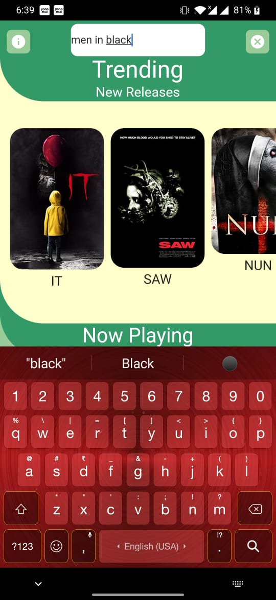

# movie_app

An app which enables users to lookup movie details.

## SAMPLES

## FEATURES
* User can lookup any movie.
* Information about the movie is displayed.
* Uses [omdbapi](http://www.omdbapi.com/) to fetch info about a movie.

## Download
- Download [movie_app](https://github.com/varunmamtora06/movie_app/releases/download/v1.1/app-release.apk).
